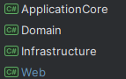
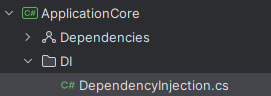
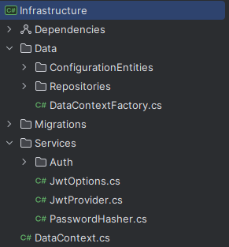
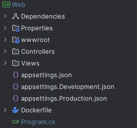

# CableShop
Магазин по продаже кабеля. Написан в рамках производственной практики
1. ### Основные возможности:
- Регистрация и авторизация пользователей
- Просмотр каталога кабеля
- Добавления товара в корзину
- Оформление заказа
- Панель администратора

2. ### Используемые технологии:
- .NET 8
- PostgreSQL 16
- Docker
3. ### Структура проекта:
- Состоит из 4 проектов
- 
- Domain - сущности, интерфейсы
- 
- ApplicationCore - содержит единственный класс DependencyInjection, внедрение зависимостей
- 
- Infrastructure - работа с базой данных
Содержит конфигурации для создания таблиц, миграции, репозитории с логикой работы бд, сервисы тесно связанные с бд
- 
- Web  - содержит контроллеры, представления, статические файлы
- 
4. ### База данных
- Cables
  - CableId (uuid)
  - CableName (text)
  - Price (integer)
  - Image (text)
  - CableDescription (text)
  - CategoryId (uuid)
- CartItems
  - CartItemId (uuid)
  - CalbeId (uuid)
  - Quantity (integer)
  - TotalPrice (numeric(18,2))
  - Status (text)
  - OrderId (uuid)
  - UserId (uuid)
- Categories
  - CategoryId (uuid)
  - Title (text)
- Orders
  - OrderId (uuid)
  - UserId (uuid)
  - OrderDate (timestamp)
  - ShippingAddress (text)
- Users
  - UserId (uuid)
  - Password (text)
  - Email (text)
  - FirstName (text)
  - PhoneNumber (text)
  - Role (boolean)
5. ### Классы & интерфейсы
 - IAuth
   - Интерфейс, который Реализует  AuthService, содержит 2 метода
   - Login, принимающий почту и пароль
   - Register, принимающий класс (сущность) Register
     - Class Register (сущность) содержит обязательные(Required) поля для регистрации пользователя
       - string Email
       - string Password (минимальная длина 6 символов)
       - string FirstName
       - string LastName
       - string PhoneNumber
 - IJwtProvider
    - Интерфейс, который Реализует JwtProvider,содержит единственный метод GenerateToken, принимающий сущность пользователя
      - GenerateToken создает и возвращает JWT токен для указанного пользователя
        - формирует claims (UserId и Role)
        - подписывает токен с помощью ключа и алгоритма шифрования
        - задает срок действия токена
        - сериализует токен в строку и возвращает
      - Users (сущность):
        - Guid UserId 
        - string Password
        - string Email
        - string FirstName
        - string LastName
        - string PhoneNumber
        - bool Role
        - List Order
 - IPasswordHasher
    -   Интерфейс, который Реализует класс PasswordHasher,Содержит 2 метода
    - Generate, принимающий пароль
      - создает хеш из переданного пароля для безопасного хранения в бд
    - Verify, принимающий пароль и хешированный пароль
      - проверяет, соответствует ли обычный пароль уже сохраненному хешу, возвращая true или false
 - ICable интерфейс, который реализует класс CableRepository
   - GetCableById (Guid Id), ищет и возвращает кабель по его id из бд
   - GetCables (), возвращает список всех кабелей
   - AddCable (Cable cable) добавляет новый кабель в бд
     - Cable:
     - Guid CableId
     - string CableName
     - int price
     - string Image
     - string CableDescription
     - List CartItems
     - Guid CategoryId
   - UpdateCable (Cable cable), обновляет данные существующего кабеля
   - DeleteCable (Guid Id), удаляет кабель по Id
   - GetByCategoryIdAsync(Guid categoryId), возвращает кабели, принадлежащие определенно категории
 - IUser Интерфейс, который реализует класс UserRepository
   - GetAllUsers (), возвращает всех пользователей (используется в админ панели)
   - CreateUser (User user), создает пользователя через админ панель
 - IOrder Интерфейс, который реализует класс OrderRepository
   - GetByIdAsync(Guid orderId), возвращает заказ по определенному Id
   - GetAllOrders(), возвращает список всех заказов
 - ICategory Интерфейс, который реализует класс CategoryRepository
   - GetById (Guid categoryId), возвращает категорию по выбранному id
   - GetAllCategories(), возвращает список всех категорий
   - AddCategory (Category category), добавляет категорию по отправленной сущности
     - Category
     - Guid CategoryId
     - string Title
     - List Cables
   - UpdateCategory (Category category), обновляет категорию по принимаемой сущности
   - DeleteCategory (Guid categoryId), удаляет категорию по введенному id
 - ICartItem Интерфейс, который реализует класс CartItem Repository
   - GetByIdAsync(Guid id), возвращает корзину с определенным id
   - GetAllAsync (), возвращает все корзины
   - GetCartItemsAsync(Guid userId), возвращает содержимое корзины определнного пользователя
   - AddAsync(CartItem cartItem), добавляет кабель в корзину
     - CartItem
     - Guid Id
     - Guid CableId
     - Cable cable
     - int Quantity
     - int totalPrice
     - Status
     - Guid? OrderId
     - Order? Order
     - Guid UserId
     - User user
   - UpdateAsync(CartItem cartItem), обновляет корзину
   - UpdateQuantityAsync(Guid id, int quantity), обновление количества товара в корзине

 - class DependencyInjection
 - Класс регистрирует сервисы и репозитории (Внедрение зависимостей)
- DataContext
  - Контекст базы данных для приложения, содержит DbSet-ы всех сущностей. Конфигурирует сущности с помощью Configuration классов
- JwtOptions
  - Опции для конфигурации jwt токенов
- ConfigurationEntities 
  - Конфигурации для сущностей, используются для создания зависимостей и полей в БД
6. ### API

- ## CableManage
  - GET /admin/cable
    - Получить список всех кабелей
    - Response: страница в админ панели со списком всех кабелей
  - #### GET /admin/cable/{id}
    - request: /admin/cable/434f0e81-6d93-4f6c-ba83-ccfe55bb8dc9      
    - response: Страница в админ панели с выбранным кабелем, используется для изменения полей в сущности
  - ### GET /admin/cable/add
    - request: /admin/cable/add           
    - response: Страница для создания кабеля через админ панель. Все поля являются обязательными для заполнения, должна существовать выбранная категория для создания кабеля
  - ### POST /admin/cable/add
    - request: /admin/cable/add?CableId=<uuid>&CableName=<string>&Price=<integer>&Image=<string>&CableDescription=<string>&CartItems=[object Object]&CartItems=[object Object]&CategoryId=<uuid>&Category.CategoryId=<uuid>&Category.Title=<string>&Category.Cables=[object Object]&Category.Cables=[object Object]       
    - response: Создание кабеля по введенным администратором данным
  - ### POST /admin/cable/update/{id}
    - request: /admin/cable/update/:id?CableId=<uuid>&CableName=<string>&Price=<integer>&Image=<string>&CableDescription=<string>&CartItems=[object Object]&CartItems=[object Object]&CategoryId=<uuid>&Category.CategoryId=<uuid>&Category.Title=<string>&Category.Cables=[object Object]&Category.Cables=[object Object]        
    - response: Обновление полей кабеля. Перенаправляет на страницу с списком всех кабелей в админ панели
  - ### POST /admin/cable/delete/{id}
    - Удаление кабеля по id
    - request: /admin/cable/delete/434f0e81-6d93-4f6c-ba83-ccfe55bb8dc9
    - response: Перенаправляет на страницу с списком всех кабелей в админ панели

- ## Cart
  - ### GET /Cart
    - Страница просмотра корзины пользователя
    - request: /Cart
  - ### GET /Cart/OrderSuccess
    - Заказ успешен
    - request: /Cart/OrderSuccess     
    - response: перенаправление на страницу: заказ успешно создан
  - ### POST /Cart/Add
    - Добавление товара в корзину
    - request: /Cart/Add?cableId=<uuid>&quantity=1
  - ### POST /Cart/Remove
    - Удаление товара из корзины
    - request: /Cart/Remove?cartItemId=<uuid>
  - ### POST /Cart/Update
    - Обновление количества товара в корзине
    - request: /Cart/Update?cartItemId=<uuid>&quantity=<integer>          
    - response: Страница с обновленным количеством товара в корзине
  - ### POST /Cart/Checkout
    - Оформление заказа
    - request:/Cart/Checkout?shippingAddress=<string>         
    - response: перенаправление на страницу с успешным оформлением заказа

- ## CartItemManage
  - ### GET /admin/cartitem
    - Получение страницы с содержимым корзины в админ панели
  - ### POST /admin/cartitem/delete/{id}
    - Удаление элементов заказа в корзине через админ панель
    - request: /admin/cartitem/delete/:id

- ## CategoryManage
  - ### GET /admin/category
    - Получение Страницы админ панели с отображением списка всех категорий
  - ### GET /admin/category/{id}
    - Получение Страницы с отображением выбранной категории, используется для обновления полей модели
  - ### GET /admin/addcategory
    - Получение страницы с добавлением категории
    - request: /Admin/AddCategory?CategoryId=<uuid>&Title=<string>&Cables=[object Object]&Cables=[object Object]
  - ### POST /admin/addcategory
    - Создать категорию
    - request: /Admin/AddCategory?CategoryId=<uuid>&Title=<string>&Cables=[object Object]&Cables=[object Object]
  - ### POST /admin/category/update/{id}
    - Обновление полей модели категории
    - request:/admin/category/update/:id?CategoryId=<uuid>&Title=<string>&Cables=[object Object]&Cables=[object Object]
  - ### POST /admin/category/delete/{id}
    - Удаление категории
    - request: /admin/category/delete/:id

  - ## Home
  - ### POST /logout
    - request: /logout        
    - reponse: перенаправление на домашнюю страницу, куки удалены, пользователь не авторизован в системе
    - ### GET /Menu
      - request: /Menu      
      - response: Получение страницы с каталогом всех кабелей. На странице присутствует выбор сортировки товара, фильтрация по категории
    - ### GET /Menu/Category/{categoryId}
      - request: /Menu/Category/434f0e81-6d93-4f6c-ba83-ccfe55bb8dc9        
      - reponse: Отфильтрованная страница Menu по выбранной категории. Отображается только тот товар, который соответствует выбранной категории

- ## Login
  - ### GET /login
    - Получение страницы для авторизации в системе
  - ### POST /login
    - request: curl --location '//login' \
    --header 'Content-Type: multipart/form-data' \
    --form 'email="test@gmail.com"' \
    --form 'password="123123"'  
    - response: Домашняя страница, пользователь авторизирован в системе

  - ## OrderManage
    - ### GET /admin/order
    - request: /admin/order       
    - response: получение страницы админ панели со всеми заказами
  - ### GET /admin/order/{id}
    - request: /admin/order/434f0e81-6d93-4f6c-ba83-ccfe55bb8dc9      
    - response: получение страницы с выбранным заказом

- ## Register
  - ### GET /register
    - Получение страницы для регистрации пользователей
    - request: /register
    - response: Страница с полями для регистрации. Поля: email, password, FirstName, LastName, PhoneNumber
  - ### POST /register
    - Принимает поля, вводимые пользователем при регистрации, после чего данные отправляются в сервис регистрации     
    - request: /register?Email=<email>&Password=<string>&FirstName=<string>&LastName=<string>&PhoneNumber=<string>    
    - response: Страница для входа в систему

- ## UserManage
  - ### GET /admin/manageuser
  - Получение страницы с списком всех пользователей 

